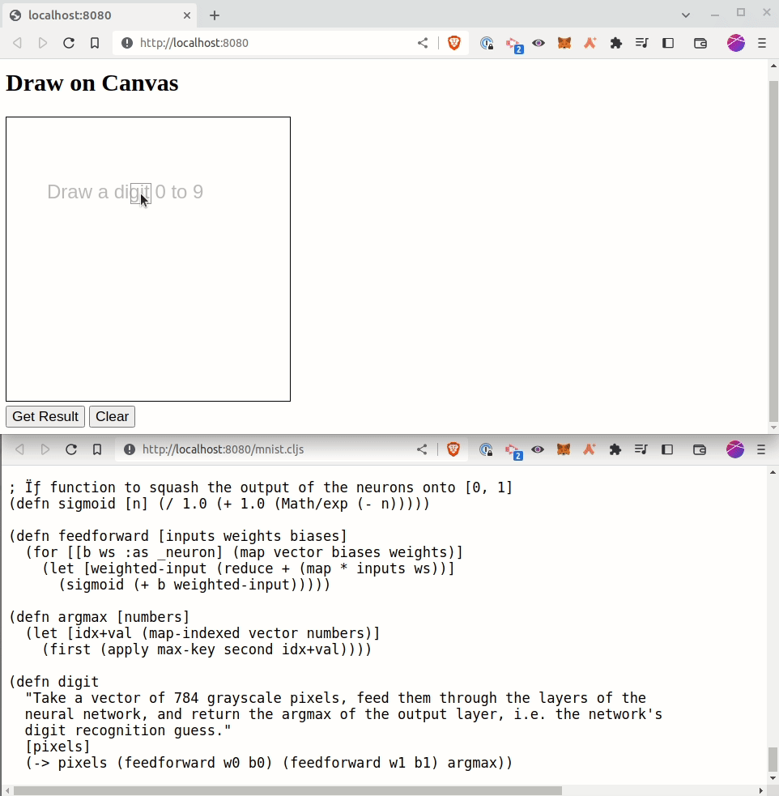

## Neural networks from scratch in Clojure

A series of neural network implementations in Clojure, building up from a 
version with no external dependencies to a version using [neanderthal](https://github.com/uncomplicate/neanderthal).

### Structure

`src/` contains four neural network implementation namespaces, each building 
upon the last.

`resources/` contains the [MNIST](https://en.wikipedia.org/wiki/MNIST_database) 
training data in a Clojure-friendly format.

`mnist-scittle/` embeds code for handwritten digit recognition in a web app 
using [scittle](https://github.com/babashka/scittle). Run it with `bb mnist`:

The recognition code — besides the weights and biases — is quite small, and 
doesn't have any dependencies. Of course, it's the training that's the hard 
part :) 

### Tests

It was enormously helpful to generate test vectors from existing neural 
network libraries and use them at the REPL during development, especially for 
the backpropagation algorithm.

Browse the files under `src/` to see the [tests inside rich comment blocks](https://github.com/matthewdowney/rich-comment-tests),
for example [this backpropagation gradient test](https://github.com/matthewdowney/clojure-neural-networks-from-scratch/blob/852bf4bb2a9e7a78e10f7b84a4310d00cbb4a71c/src/com/mjdowney/nn_01.clj#L364).

Run tests with `bb test`.

### Resources

I can recommend:
- [3Blue1Brown's video series on neural networks](https://www.youtube.com/playlist?list=PLZHQObOWTQDNU6R1_67000Dx_ZCJB-3pi), with visualizations and intuitive explanations. Good initial context.
- [Michael Nielsen's neural networks and deep learning tutorial](http://neuralnetworksanddeeplearning.com/chap1.html), which uses Python and numpy.
- [Andrej Karpathy's intro to neural networks and backpropagation](https://youtu.be/VMj-3S1tku0), which is pure Python (no numpy).
